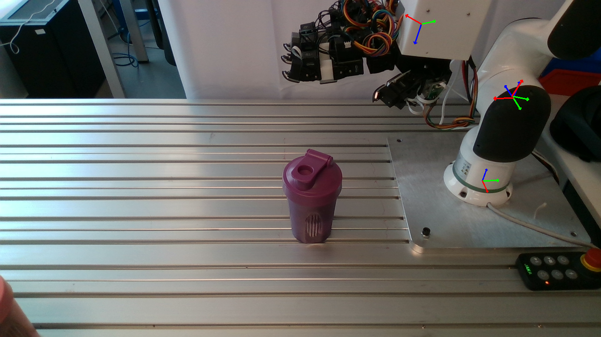

# Robot Urdf and Handeye Varification Tool

## Overview

This repository provides tools for straightforward verification of the robot's URDF model and hand-eye calibration results by projecting the robot's link poses onto the RGB image.

 

### URDF Visualization
```bash
python vis_urdf_via_urdfpy.py
```

or 
```bash
vis_urdf_via_sapien.py
```

### Projection to RGB Image
```bash
python main.py
```

### Importants
1. All parameters are defined in `constants.py`; modify them there.
2. Ensure the joint order matches the order of your robot's joint values from simulation or real hardware, as they may differ from the URDF.
3. The example projection results for the hand may appear incorrect, likely due to the low-cost robot hand not reaching the exact pose. If this assumption is incorrect, please let me know.

## Contact
If you have any suggestion or questions, please feel free to contact us:

[Tianhao Wu](https://tianhaowuhz.github.io/): [thwu@stu.pku.edu.cn](mailto:thwu@stu.pku.edu.cn)


## License
This project is released under the MIT license. See [LICENSE](LICENSE) for additional details.